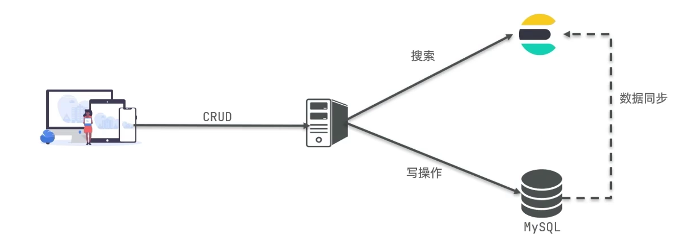
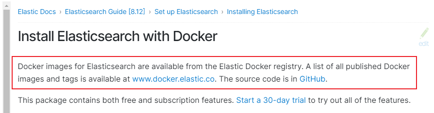
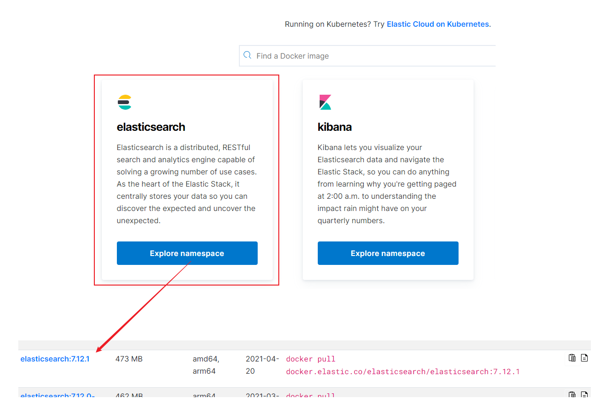
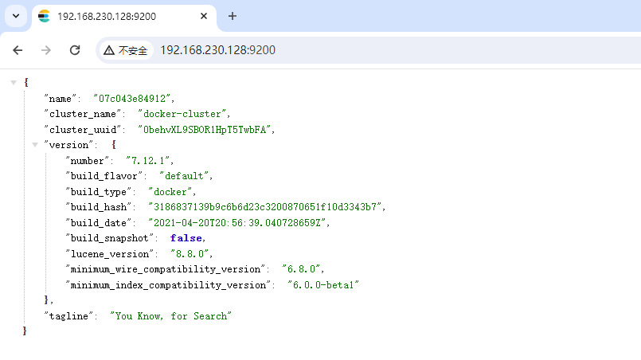

# ElasticSearch笔记


## 初识ES

<h4>什么是ElasticSearch</h4>

<span style="color:red;">**ElasticSearch**</span>是一款非常强大的开源搜索引擎，可以帮助我们从海量数据中快速找到需要的内容。

它的可应用场景包括但不限于：

- Github内容搜索并高亮显示关键字
- 京东商品信息搜索并高亮显示关键字
- 百度、谷歌搜索
- 打车软件上的附近车辆搜索


**ElasticSearch** 结合 **Kibana**、**Logstash**、**Beats** 组成了<span style="color:red;">ElasticStack（ELK）</span>。被广泛应用在日志数据分析、实时监控等领域。

==ElasticSearch是 ELK 的核心，负责存储、搜索、分析数据。==


<h4>ElasticSearch的发展</h4>

ES的底层是基于 <span style="color:red;">**Lucene**</span> 实现的。

> Lucene是一个Java语言的搜索引擎类库，是Apache公司的顶级项目，由*DougCutting*与1999年研发。
>
> 官网地址：https://lucene.apache.org/
>
> Lucene的优势如下
>
> - 易扩展（类库相当于一个jar包，开发人员可以基于它进行二次开发）
> - 高性能（核心API实现了 <span style="color:red;">倒排索引</span> 数据结构）
>
> Lucene的劣势如下
>
> - 只限于Java语言开发
> - 学习曲线陡峭
> - 不支持水平扩展 

2004年*ShayBanon*基于**Lucene**开发了**Compass**

2010年*ShayBanon*重写了**Compass**，取名为<span style="color:red;">**ElasticSearch**</span>

官网地址：https://www.elastic.co/cn/

相比于Lucene，ElasticSearch具备下列优势：

- 支持分布式，可水平扩展
- 提供Restful接口，可被任何语言调用


<h4>搜索引擎技术排名前三</h4>

1.ElasticSearch：开源的分布式搜索引擎

2.Splunk：商业项目

3.Solr：Apache的开源搜索引擎


### 倒排索引

#### 正向索引

传统数据库（如MySQL）采用正向索引，例如给下表（tb_goods）中的id创建索引：


当我们需要对 title 进行模糊查询的时候，索引是不生效的


#### 倒排索引

ElasticSearch采用倒排索引：

- 文档（document）：每条数据就是一个文档
- 词条（term）：文档按照语义分成的词语


基于倒排索引的查询是分两步执行的，但两步都是索引级别的查询，所以总的查询效率要比模糊匹配高很多


<span style="color:red;">由此可见，倒排索引是相对于正向索引而“倒”的</span>：正向索引是先找到文档，然后判断文档内容是否符合条件；倒排索引是先找到符合条件的词条，再找对应的文档


### 概念对比

#### 文档

ES是面向文档存储的，可以是数据库中的一条商品数据，一个订单信息。

<span style="color:#be002f;">文档数据会被序列化为json格式后存储在ES中。</span>


#### 索引

- 索引（Index）：<span style="color:blue;">相同类型的文档的集合</span>
- 映射（Mapping）：<span style="color:blue;">索引中文档的字段约束信息，类似表的结构约束</span>


#### ES与MySQL的概念对比


MySQL：擅长事物类型操作，可以确保数据的安全和一致性

ES：擅长海量数据的搜索、分析、计算

两者可以应用在同一架构中：




### 安装ES

安装**ElasticSearch**的同时，还需要安装**kibana**组件，因为kibana组件中提供了一个**devtools**工具，<span style="color:red;">可以帮助我们非常方便地编写ElasticSearch中的DSL语句</span>。

#### 1、部署单点ES

首先创建网络，因为我们还需要部署kibana容器，为了让ES和kibana容器互联，所以需要创建一个网络：

```sh
# 这里先创建一个网络
$ docker network create es-net
```

---

然后从官方文档中获取ElasticSearch的docker镜像拉取命令：https://www.elastic.co/guide/en/elasticsearch/reference/current/docker.html



这里我们选择 `7.12.1` 版本的 ES，获取镜像拉取命令：



kibana的镜像命令获取方式与ES相同！！

---

最后运行docker命令，部署单点es：

```sh
$ docker run -d \
$     --name es \
$     -e "ES_JAVA_OPTS=-Xms512m -Xmx512m" \
$     -e "discovery.type=single-node" \
$     -v es-data:/usr/share/elasticsearch/data \
$     -v es-plugins:/usr/share/elasticsearch/plugins \
$     --privileged \
$     --network es-net \
$     -p 9200:9200 \
$     -p 9300:9300 \
$ docker.elastic.co/elasticsearch/elasticsearch:7.12.1
```

命令说明：

- `-e "cluster.name=es-docker-cluster"`：设置集群名称
- `-e "http.host=0.0.0.0"`：监听的地址，可以外网访问
- `-e "ES_JAVA_OPTS=-Xms512m -Xmx512m"`：内存大小
- `-e "discovery.type=single-node"`：非集群模式
- `-v es-data:/usr/share/elasticsearch/data`：挂载逻辑卷，绑定 es 的数据目录
- `-v es-logs:/usr/share/elasticsearch/logs`：挂载逻辑卷，绑定 es 的日志目录
- `-v es-plugins:/usr/share/elasticsearch/plugins`：挂载逻辑卷，绑定 es 的插件目录
- `--privileged`：授予逻辑卷访问权
- `--network es-net`：加入一个名为 es-net 的网络中
- `-p 9200:9200`：端口映射配置


在浏览器中输入 http://YourIP:9200 即可看到 elasticsearch 的响应结果：




#### 2、部署kibana

kibana可以给我们提供一个elasticsearch的可视化界面

运行docker命令，部署kibana：

```sh
$ docker run -d \
$     --name kibana \
$     -e ELASTICSEARCH_HOSTS=http://es:9200 \
$     --network es-net \
$     -p 5601:5601 \
$ kibana:7.12.1
```

命令说明：

- `--net-work es-net`：加入一个名为 es-net 的网络中，与 elasticsearch 在同一个网络中
- `-e ELASTICSEARCH_HOSTS=http://es:9200`：设置elasticsearch的地址，因为kibana已经与elasticsearch在一个网络，因此可以直接用容器名访问elasticsearch
- `-p 5601:5601`：端口映射配置

kibana启动一般比较慢，需要多等待一会，可以通过命令查看容器的运行日志：

```sh
$ docker logs -f kibana
```


#### 3、安装IK分词器


#### 4、部署ES集群


123
