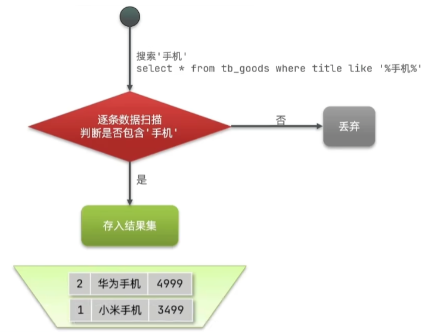
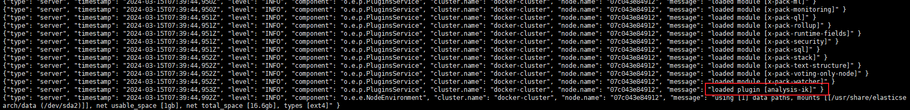
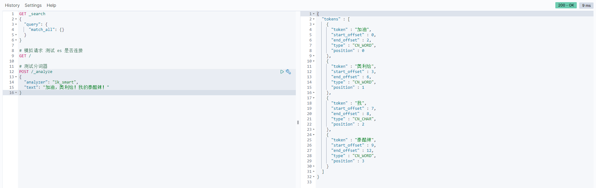

# ElasticSearch笔记


## 初识ES

<h4>什么是ElasticSearch</h4>

<span style="color:red;">**ElasticSearch**</span>是一款非常强大的开源搜索引擎，可以帮助我们从海量数据中快速找到需要的内容。

它的可应用场景包括但不限于：

- Github内容搜索并高亮显示关键字
- 京东商品信息搜索并高亮显示关键字
- 百度、谷歌搜索
- 打车软件上的附近车辆搜索


**ElasticSearch** 结合 **Kibana**、**Logstash**、**Beats** 组成了<span style="color:red;">ElasticStack（ELK）</span>。被广泛应用在日志数据分析、实时监控等领域。

==ElasticSearch是 ELK 的核心，负责存储、搜索、分析数据。==


<h4>ElasticSearch的发展</h4>

ES的底层是基于 <span style="color:red;">**Lucene**</span> 实现的。

> Lucene是一个Java语言的搜索引擎类库，是Apache公司的顶级项目，由*DougCutting*于1999年研发。
>
> 官网地址：https://lucene.apache.org/
>
> Lucene的优势如下
>
> - 易扩展（类库相当于一个jar包，开发人员可以基于它进行二次开发）
> - 高性能（核心API实现了 <span style="color:red;">倒排索引</span> 数据结构）
>
> Lucene的劣势如下
>
> - 只限于Java语言开发
> - 学习曲线陡峭
> - 不支持水平扩展 

2004年*ShayBanon*基于**Lucene**开发了**Compass**

2010年*ShayBanon*重写了**Compass**，取名为<span style="color:red;">**ElasticSearch**</span>

官网地址：https://www.elastic.co/cn/

相比于Lucene，ElasticSearch具备下列优势：

- 支持分布式，可水平扩展
- 提供Restful接口，可被任何语言调用


<h4>搜索引擎技术排名前三</h4>

1.ElasticSearch：开源的分布式搜索引擎

2.Splunk：商业项目

3.Solr：Apache的开源搜索引擎


### 倒排索引

#### 正向索引

传统数据库（如MySQL）采用正向索引，例如给下表（tb_goods）中的id创建索引：


当我们需要对 title 进行模糊查询的时候，索引是不生效的



#### 倒排索引

ElasticSearch采用倒排索引：

- 文档（document）：每条数据就是一个文档
- 词条（term）：文档按照语义分成的词语


基于倒排索引的查询是分两步执行的，但两步都是索引级别的查询，所以总的查询效率要比模糊匹配高很多


<span style="color:red;">由此可见，倒排索引是相对于正向索引而“倒”的</span>：正向索引是先找到文档，然后判断文档内容是否符合条件；倒排索引是先找到符合条件的词条，再找对应的文档


### 概念对比

#### 文档

ES是面向文档存储的，可以是数据库中的一条商品数据，一个订单信息。

<span style="color:#be002f;">文档数据会被序列化为json格式后存储在ES中。</span>


#### 索引

- 索引（Index）：<span style="color:blue;">相同类型的文档的集合</span>
- 映射（Mapping）：<span style="color:blue;">索引中文档的字段约束信息，类似表的结构约束</span>


#### ES与MySQL的概念对比


MySQL：擅长事物类型操作，可以确保数据的安全和一致性

ES：擅长海量数据的搜索、分析、计算

两者可以应用在同一架构中：


### 安装ES

安装**ElasticSearch**的同时，还需要安装**kibana**组件，因为kibana组件中提供了一个**devtools**工具，<span style="color:red;">可以帮助我们非常方便地编写ElasticSearch中的DSL语句</span>。

#### 1、部署单点ES

首先创建网络，因为我们还需要部署kibana容器，为了让ES和kibana容器互联，所以需要创建一个网络：

```sh
# 这里先创建一个网络
$ docker network create es-net
```

---

然后从官方文档中获取ElasticSearch的docker镜像拉取命令：https://www.elastic.co/guide/en/elasticsearch/reference/current/docker.html


这里我们选择 `7.12.1` 版本的 ES，获取镜像拉取命令：


kibana的镜像命令获取方式与ES相同！！

---

最后运行docker命令，部署单点es：

```sh
$ docker run -d \
$     --name es \
$     -e "ES_JAVA_OPTS=-Xms512m -Xmx512m" \
$     -e "discovery.type=single-node" \
$     -v es-data:/usr/share/elasticsearch/data \
$     -v es-plugins:/usr/share/elasticsearch/plugins \
$     --privileged \
$     --network es-net \
$     -p 9200:9200 \
$     -p 9300:9300 \
$ docker.elastic.co/elasticsearch/elasticsearch:7.12.1
```

命令说明：

- `-e "cluster.name=es-docker-cluster"`：设置集群名称
- `-e "http.host=0.0.0.0"`：监听的地址，可以外网访问
- `-e "ES_JAVA_OPTS=-Xms512m -Xmx512m"`：内存大小
- `-e "discovery.type=single-node"`：非集群模式
- `-v es-data:/usr/share/elasticsearch/data`：挂载逻辑卷，绑定 es 的数据目录
- `-v es-logs:/usr/share/elasticsearch/logs`：挂载逻辑卷，绑定 es 的日志目录
- `-v es-plugins:/usr/share/elasticsearch/plugins`：挂载逻辑卷，绑定 es 的插件目录
- `--privileged`：授予逻辑卷访问权
- `--network es-net`：加入一个名为 es-net 的网络中
- `-p 9200:9200`：端口映射配置


在浏览器中输入 http://YourIP:9200 即可看到 elasticsearch 的响应结果：


#### 2、部署kibana

kibana可以给我们提供一个elasticsearch的可视化界面

运行docker命令，部署kibana：

```sh
$ docker run -d \
$     --name kibana \
$     -e ELASTICSEARCH_HOSTS=http://es:9200 \
$     --network es-net \
$     -p 5601:5601 \
$ docker.elastic.co/kibana/kibana:7.12.1
```

命令说明：

- `--net-work es-net`：加入一个名为 es-net 的网络中，与 elasticsearch 在同一个网络中
- `-e ELASTICSEARCH_HOSTS=http://es:9200`：设置elasticsearch的地址，因为kibana已经与elasticsearch在一个网络，因此可以直接用容器名访问elasticsearch
- `-p 5601:5601`：端口映射配置

kibana启动一般比较慢，需要多等待一会，可以通过命令查看容器的运行日志：

```sh
$ docker logs -f kibana
```

当看到如下日志输出时，就说明kibana启动成功了：


在浏览器中输入 http://YourIP:5601 访问kibana


接下来试用一下kibana的devtools，来获取es的信息


模拟一个简单的请求


#### 3、安装IK分词器

es在创建倒排索引时需要对文档分词；在搜索时，需要对用户输入内容分词。但默认的分词规则对中文处理并不友好。

我们在kibana的devtools中测试：


> 语法说明：
>
> - POST：请求方式
> - /_analyze：请求路径，这里省略了 http://YourIP:9200，有kibana帮我们补充
> - 请求参数，Json风格：
>     - analyzer：分词器类型，这里是默认的standard分词器
>     - text：要分词的内容

可以看到，es的标准分词规则对中文是逐字拆分的，这显然不符合期望。


一般处理中文分词，会使用IK分词器：[官方github仓库](https://github.com/infinilabs/analysis-ik)

安装步骤如下：

**在线安装ik插件**

```sh
# 进入容器内部
$ docker exec -it elasticsearch /bin/bash

# 在线下载并安装
$ ./bin/elasticsearch-plugin install https://github.com/infinilabs/analysis-ik/releases/download/v7.12.1/elasticsearch-analysis-ik-7.12.1.zip

# 退出
$ exit
# 重启容器
$ docker restart elasticsearch
```


**离线安装ik插件**

安装插件需要知道elasticsearch的plugins目录位置，而我们用了数据卷挂载，因此需要查看elasticsearch的数据卷目录，通过下面命令查看：

```sh
$ docker volume inspect es-plugins
```

显示结果如下：


说明plugins目录被挂载到了 `/var/lib/docker/volumes/es-plugins/_data` 这个目录中。


下载分词器压缩包并解压，重命名为ik：


并将ik目录上传到es容器的插件数据卷`/var/lib/docker/volumes/es-plugins/_data`中，随后重启es容器即可。

```sh
$ docker restart es
$ docker logs -f es
```

可以看到es加载插件的日志输出：




再次回到kibana界面上的控制台，尝试一下ik分词器的中文分词效果

==IK分词器包含两种模式：==

1. `ik_smart`：智能切分，粗粒度
2. `ik_max_word`：最细切分，细粒度


**ik分词器拓展和停用词典**

ik分词器能够进行中文分词的底层原理就是：

​    ik分词器中存在着中文词典，在对中文进行分词的时候，ik分词器会根据字典对内容进行逐一比对。（其他中文分词器的原理也类似）

但是一个词典无论它的词汇量再怎么丰富，也始终是有限的。

而且随着时代的进步和发展，也会出现许多未被收录的新型词汇，对于使用这些词汇的内容，无法进行准确的分词。

<span style="color:red;">此时就需要我们去对分词器中的词典进行拓展，同时也可以停用掉一些无意义的或敏感的词汇，来减少分词时占用的内存。</span>


要拓展ik分词器的词库，只需要修改一个ik分词器目录中的config目录下的`IkAnalyzer.cfg.xml`文件

（在其中添加指定的字典文件名称，并在同级目录下创建字典文件即可）

```xml
<?xml version="1.0" encoding="UTF-8"?>
<!DOCTYPE properties SYSTEM "http://java.sun.com/dtd/properties.dtd">
<properties>
	<comment>IK Analyzer 扩展配置</comment>
	<!--用户可以在这里配置自己的扩展字典 -->
	<entry key="ext_dict">ext.dic</entry>
	 <!--用户可以在这里配置自己的扩展停止词字典-->
	<entry key="ext_stopwords">stopword.dic</entry>
	<!--用户可以在这里配置远程扩展字典 -->
	<!-- <entry key="remote_ext_dict">words_location</entry> -->
	<!--用户可以在这里配置远程扩展停止词字典-->
	<!-- <entry key="remote_ext_stopwords">words_location</entry> -->
</properties>
```

随后在相应的字典文件内容中添加词语，即可完成词典的拓展或停用。

比如在 ext.dic 中添加词汇：白嫖、奥利给、泰酷辣、人艰不拆

在 stopword.dic 中添加词汇：的、了、嗯、毒品、嘤

重启es后，再尝试一下分词，可以看到结果如下：




## 索引库操作

### mapping映射属性

mapping是对索引库中文档的约束，**常见**的mapping属性包括：

- type：字段数据类型，常见的简单类型有：
    - 字符串：text，可分词的文本；keyword，精确值（例如品牌、国家、IP地址）
    - 数值：long、integer、short、byte、double、float
    - 布尔：boolean
    - 日期：date
    - 对象：object
- index：是否创建倒排索引，默认为true
- analyzer：使用哪种分词器
- properties：该字段的子字段


### 创建索引库

es中通过Restful请求操作索引库、文档。请求内容用DSL语句来表示。

创建索引库和mapping的DSL语法如下：

```DSL
PUT /索引库名称
{
    "mappings": {
        "properties": {
            "字段名1": {
                "type": "text",
                "analyzer": "ik_smart"
            },
            "字段名2": {
            	"type": "keyword",
            	"index": "false"
            },
            "字段名3": {
            	"properties": {
            		"子字段": {
                        "type": "keyword"
                    }
            	}
            },
            // ...略
        }
    }
}
```

实操案例：


### 查看、删除索引库

查看索引库语法：

```DSL
GET /索引库名称
```

删除索引库语法：

```DSL
DELETE /索引库名称
```


示例：

```DSL
GET /stone
DELETE /stone
```


### 修改索引库

<span style="color:red;">在ES中索引库是不允许修改的</span>，因为索引库创建完以后，es会基于其mapping去创建倒排索引。

如果索引库中字段被修改了，就会导致原有的整个倒排索引彻底失效。

索引库和mapping一旦创建无法修改，**但是可以添加新的字段**，语法如下：

```DSL
PUT /索引库名称/_mapping
{
	"properties": {
		"新字段名": {
			"type": "integer"
		}
	}
}
```

实操案例：


## 文档操作

### 新增文档

新增文档的DSL语法如下：


实操案例：


### 查询文档

语法：

```DSL
GET /索引库名称/_doc/文档id
```


### 删除文档

语法：

```DSL
DELETE /索引库名称/_doc/文档id
```


示例：

```DSL
GET /stone/_doc/1
DELETE /stone/_doc/1
```


### 修改文档

方式一：全量修改，会删除旧文档，添加新文档


方式二：增量修改，修改指定字段


实操案例——全量修改文档


实操案例——新增不存在的文档


实操案例——增量修改文档


## RestClient操作索引库

什么是RestClient？

ES官方提供了各种不同语言的客户端，用来操作ES。

这些客户端的本质就是组装DSL语句，通过http请求发送给ES。

官方文档地址：https://www.elastic.co/guide/en/elasticsearch/client/index.html

==案例：利用JavaRestClient实现创建、删除索引库，判断索引库是否存在==

根据酒店数据创建索引库，索引库名为hotel，mapping属性根据数据库结构定义。

基本步骤如下：

（**前置操作**：创建数据库，并运行tb_hotel.sql，创建对应的库表，随后导入hotel-demo项目）


### 创建索引库

#### 1.分析数据结构

打开hotel-demo，分析数据结构，定义mapping属性

在创建mapping时要考虑的问题：字段名、数据类型、是否参与搜索、是否分词、如果分词，分词器是什么？

根据以上思路，针对数据库表tb_hotel进行分析：


定义mapping的语法如下：

```json
# 创建酒店的mapping
PUT /hotel
{
    "mappings": {
        "properties": {
            "id": {
                # id属性比较特殊，一般采用 keyword 类型
                "type": "keyword",
                # id属性需要参与搜索
                "index": "true"
            },
            "name": {
                "type": "text",
                "index": "true",
                "analyzer": "ik_max_word"
            },
            "address": {
                # address 不需要分词，不参与搜索
                "type": "keyword",
                "index": "false"
            },
            "price": {
                "type": "integer",
                "index": "true"
            },
            "score": {
                "type": "integer",
                "index": "true"
            },
            "brand": {
                # brand 不需要分词，参与搜索
                "type": "keyword",
                "index": "true"
            },
            "city": {
                # city 不需要分词，参与搜索
                "type": "keyword",
                "index": "true"
            },
            "starName": {
                # starName 采用驼峰写法，不需要分词，参与搜索
                "type": "keyword",
                "index": "true"
            },
            "business": {
                # business 不需要分词，参与搜索
                "type": "keyword",
                "index": "true"
            },
            "location": {
                # 经度 和 纬度 共同组成一个新属性 地理坐标，类型为 geo_point
                "type": "geo_point",
            },
            "pic": {
                # pic 既不分词，也不参与搜索
                "type": "keyword",
                "index": "false",
            }
        }
    }
}
```

<span style="color:red;">ES支持两种地理坐标数据类型：</span>

- geo_point：由纬度（latitude）和经度（longitude）确定的一个点。例如："32.8752345, 120.2981576"；
- geo_shape：由多个geo_point组成的复杂几何图形。例如一条直线，"LINESTRING (-77.03653  38.897676, -77.009051  38.889939)"


在ES中，单个字段的搜索效率是要比多个字段的搜索效率高的，因此我们可以使用 ==字段拷贝属性`copy_to`== 将搜索条件涉及的多个字段拷贝到一个字段中。

<span style="color:red;">字段拷贝可以使用copy_to属性将当前字段拷贝到指定字段</span>

```json
# 示例
"all": {
    "type": "text",
    "analyzer": "ik_max_word"
},
"brand": {
    "type": "keyword",
    "copy_to": "all"
}
```

对mapping属性进行改造后如下：

```json
# 创建酒店的mapping
PUT /hotel
{
    "mappings": {
        "properties": {
            "id": {
                # id属性比较特殊，一般采用 keyword 类型
                "type": "keyword",
                # id属性需要参与搜索
                "index": "true"
            },
            "name": {
                "type": "text",
                "index": "true",
                "analyzer": "ik_max_word",
                # 将该属性拷贝到 all 属性中，参与条件搜索
                "copy_to": "all"
            },
            "address": {
                # address 不需要分词，不参与搜索
                "type": "keyword",
                "index": "false"
            },
            "price": {
                "type": "integer",
                "index": "true"
            },
            "score": {
                "type": "integer",
                "index": "true"
            },
            "brand": {
                # brand 不需要分词，参与搜索
                "type": "keyword",
                "index": "true"
            },
            "city": {
                # city 不需要分词，参与搜索
                "type": "keyword",
                "index": "true"
            },
            "starName": {
                # starName 采用驼峰写法，不需要分词，参与搜索
                "type": "keyword",
                "index": "true"
            },
            "business": {
                # business 不需要分词，参与搜索
                "type": "keyword",
                "index": "true",
                # 将该属性拷贝到 all 属性中，参与条件搜索
                "copy_to": "all"
            },
            "location": {
                # 经度 和 纬度 共同组成一个新属性 地理坐标，类型为 geo_point
                "type": "geo_point",
            },
            "pic": {
                # pic 既不分词，也不参与搜索
                "type": "keyword",
                "index": "false",
            },
            
            
            # 定义一个属性，用来拷贝其他属性，并作为条件搜索字段
            "all": {
                "type": "text",
                "analyzer": "ik_max_word"
            }
        }
    }
}
```


#### 2.初始化JavaRestClient

引入es的RestHighLevelClient依赖

```xml
<!--ElasticSearch客户端-->
<dependency>
    <groupId>org.elasticsearch.client</groupId>
    <artifactId>elasticsearch-rest-high-level-client</artifactId>
</dependency>
```

初始化RestHighLevelClient

（我们在测试类`HotelIndexTest`中编写初始化代码）

```java
package com.stone.hotel;

import org.apache.http.HttpHost;
import org.elasticsearch.client.RestClient;
import org.elasticsearch.client.RestHighLevelClient;
import org.junit.jupiter.api.AfterEach;
import org.junit.jupiter.api.BeforeEach;
import org.junit.jupiter.api.Test;

import java.io.IOException;

public class HotelIndexTest {

    private RestHighLevelClient client;

    @BeforeEach
    void setUp() {
        // 创建客户端实例
        this.client = new RestHighLevelClient(RestClient.builder(
                // 集群写法：
                // HttpHost.create("http://192.168.230.128:9200"),
                // HttpHost.create("http://192.168.230.128:9200"),
                // HttpHost.create("http://192.168.230.128:9200")

                HttpHost.create("http://192.168.230.128:9200") // 单点写法
        ));
    }

    @AfterEach
    void tearDown() throws IOException {
        // 销毁客户端实例
        this.client.close();
    }

    @Test
    void testInit() {
        // 测试客户端是否成功初始化
        System.out.println(client);
    }
}
```

testInit方法执行成功的结果如下：


<span style="color:red;">BeforeEach和AfterEach注解的作用</span>

`@BeforeEach`和`@AfterEach`是java测试框架**JUnit**中的两个注解；

`@BeforeEach`

- 作用：在每个测试方法执行之前都会被执行一次；
- 用途：通常用于设置测试环境、初始化测试数据、创建测试对象等操作。例如，可以在`@BeforeEach`方法中连接数据库、加载配置文件、创建模拟对象等；
- 好处：确保每个测试方法都在相同的初始状态下执行，提高测试的可重复性和可靠性。避免了在每个测试方法中重复编写相同的初始化代码，提高了测试代码的可读性和可维护性；

`@AfterEach`

- 作用：在每个测试方法执行之后都会被执行一次；
- 用途：通常用于清理测试环境、释放资源、验证测试结果等操作。例如，可以在`@AfterEach`方法中关闭数据库连接、删除临时文件、验证测试方法的输出是否符合预期等；
- 好处：确保测试方法执行后，测试环境被清理干净，避免对后续测试产生影响。同时，也可以及时发现测试方法中的错误，提高测试的效率和可靠性；

**注意事项：**

①执行顺序

`@BeforeEach`和`@AfterEach`方法的执行顺序是按照测试方法的定义顺序执行的。

也就是说，如果有多个测试方法，`@BeforeEach`方法会在每个测试方法执行之前依次执行，`@AfterEach`方法会在每个测试方法执行之后依次执行。

②异常处理

如果`@BeforeEach`方法中抛出了异常，那么当前测试方法将不会被执行；

如果`@AfterEach`方法中抛出了异常，那么异常会被记录下来，但不会影响其他测试方法的执行。

③资源管理

在使用`@BeforeEach`和`@AfterEach`方法进行资源管理时，要确保资源的正确释放，避免资源泄露。

例如：在连接数据库时，要确保在`@AfterEach`方法中正确关闭数据库连接。


#### 3.利用JavaRestClient创建索引库

https://www.bilibili.com/video/BV1LQ4y127n4?spm_id_from=333.788.player.switch&vd_source=71b23ebd2cd9db8c137e17cdd381c618&p=93

4.利用JavaRestClient删除索引库


5.利用JavaRestClient判断索引库是否存在


